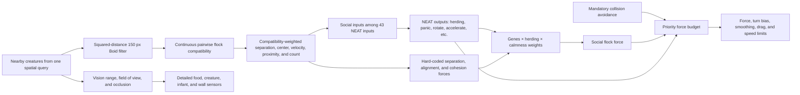

# Creature Flocking System: Implementation and Influence Report

> **Historical boundary.** Sections 1–19 retain the 81.25-hour diagnosis while
> their implementation descriptions reflect the current behavior. Sections 20
> onward document the sole current evolutionary-flocking architecture.

## 1. Executive summary

The flocking system is a hybrid of evolved decision-making and hard-coded boid-style physics:

- A creature's NEAT brain decides **whether and how strongly to herd** at the current moment through one `herding` output.
- Three inherited biological genes decide the creature's fixed preference for **separation**, **alignment**, and **cohesion**.
- A continuous compatibility score decides how much every positive-compatible
  neighbor inside a 150 px omnidirectional radius counts as a flockmate.
- The sensing system turns those neighbors into social neural inputs and
  internal steering measurements independently of detailed visual occlusion.
- The movement system combines separation, alignment, and cohesion forces, but gives mandatory collision avoidance higher priority and direct neural acceleration lower priority.
- Panic attenuates alignment and cohesion, preserves separation, and increases the available movement and turning limits.

The most important distinction is that the brain does **not** choose separation, alignment, and cohesion independently on every tick. It chooses a single herding drive. The three inherited genes then split that drive into the three flocking components.

The default fitness now includes the bounded flocking benchmark at a `2.0`
score weight, alongside survival, food, energy, reproduction, and offspring
survival.

The historical 81.25-hour saved simulation confirmed that its configuration
did not reliably evolve flocking. Its evolved brains received very little
social evidence and did not functionally respond to the flock inputs. The
evidence and severity-ranked problems from that run are detailed next; the
current implementation changes that sensing, steering, attenuation, and
fitness context.

## 2. Long-run failure analysis: why flocking did not emerge

### 2.1 Diagnostic conclusion

No arithmetic or direction error was found in the separation, alignment, or
cohesion vector code. The focused tests still demonstrate that:

- cohesion pulls a controlled pair together;
- separation maintains a gap;
- alignment matches actual neighbor velocity;
- the combined force and turn bias are bounded and correctly directed.

However, those forces are expressed only after the NEAT brain produces
herding. The saved population did not evolve a stable, functional mapping
from social observations to herding or directional turning. High flocking
genes consequently remained mostly latent.

This is not simply a case of evolution needing more time. The saved run
contains:

| Long-run evidence | Measured value |
|---|---:|
| Simulated duration | 81.25 hours |
| Births | 84,837 |
| Deaths | 84,793 |
| Species IDs created | 1,236 |
| Living creatures in final checkpoint | 39 |
| Active species in final checkpoint | 5 |
| Final compatibility threshold | 7.0, the configured maximum |

The population therefore had many mutation and selection opportunities.
Flocking pathways appeared at some checkpoints but did not become a stable,
functional adaptation.

Evidence was read from:

- `saves/simulation_20260721T122442476803Z_f7500cba/telemetry.sqlite`;
- `saves/simulation_20260721T122442476803Z_f7500cba/checkpoint.pkl`;
- the 16 hourly checkpoints in that simulation directory.

The telemetry extends slightly beyond the quick checkpoint, which explains
small differences between event totals and the checkpoint's living
population.

### 2.2 Final-checkpoint behavioral evidence

The final checkpoint was loaded with telemetry disabled and evaluated without
advancing physics. The current source contract matches the checkpoint:
38 sensors, 14 actions, sensing schema 3, and action schema 1.

#### Social exposure

| Metric across 39 living creatures | Result |
|---|---:|
| Creatures seeing no other creature | 30/39, or 76.9% |
| Creatures with a compatible visible flockmate | 9/39 |
| Mean visible-creature count | 0.231 |
| Mean effective flockmate count | 0.117 |
| Mean normalized flockmate-count input | 0.032 |
| Maximum visible-creature count | 1 |

No living creature could currently see more than one other creature. This
means the brain almost never observes a group, a group center, or a meaningful
average heading.

The geometry explains much of this result. The world covers
`3,200 × 2,200 = 7,040,000` square pixels, while the population is capped at
55. In the final checkpoint, the mean range was approximately 178 pixels and
the mean field of view was approximately 105 degrees. If positions were
uniform, those values imply only about `0.157` expected visible neighbors and
roughly a 14.5% chance of seeing any neighbor. The observed 23.1% was slightly
higher because creatures were not perfectly uniform, but it remained far too
low for frequent social selection.

Six checkpoint samples from the run showed that this was persistent:

| Simulated hour | Population | No visible creature | Mean visible count |
|---:|---:|---:|---:|
| 5.0 | 37 | 73.0% | 0.351 |
| 25.0 | 55 | 56.4% | 0.636 |
| 44.9 | 50 | 64.0% | 0.480 |
| 59.9 | 54 | 79.6% | 0.222 |
| 69.9 | 49 | 69.4% | 0.388 |
| 81.3 | 39 | 76.9% | 0.231 |

Even at the best sampled point, more than half the population had no visible
social target.

#### Genes were present, but expression was weak

The final inherited-gene means were:

| Gene | Mean | Median |
|---|---:|---:|
| Separation | 0.765 | 0.798 |
| Alignment | 0.650 | 0.700 |
| Cohesion | 0.513 | 0.585 |

The lack of flocking was therefore not caused by all three genes evolving to
zero.

The live neural actions told a different story:

| Current action/force metric | Result |
|---|---:|
| Mean herding output | 0.435 |
| Creatures with herding above 0.1 | 21/39 |
| Mean panic output | 0.498 |
| Creatures with requested social force above 1 | 4/39 |
| Median requested social-force magnitude | 0 |

Herding was often generated by biases or non-social inputs while no neighbor
was present. Conversely, when a neighbor was present, the brain generally did
not change herding in response.

After applying genes, herding, and panic, the effective weights were:

| Effective component weight | Mean | Median | Exactly inactive |
|---|---:|---:|---:|
| Separation | 0.357 | 0.166 | 18/39 |
| Alignment | 0.082 | 0 | 28/39 |
| Cohesion | 0.113 | 0 | 28/39 |

Alignment and cohesion were inactive for 71.8% of the living population at
the inspected state. Panic was a major cause because it multiplies both
components by `1 - panic`.

#### Social inputs did not control the evolved brains

Topology inspection of the 39 live NEAT genomes found:

| Enabled topology property | Living brains |
|---|---:|
| Any flock sensor can reach herding | 5/39 |
| Direct flock-sensor-to-herding connection | 0/39 |
| Flockmate count can reach herding | 0/39 |
| Flock center angle can reach rotate | 0/39 |
| Average relative heading can reach rotate | 1/39 |

An enabled graph path does not guarantee a meaningful behavioral effect.
To test function, every living brain received two otherwise-identical sensor
snapshots:

1. no flock;
2. a standardized signal representing three effective flockmates, with
   center proximity `0.5` and
   directional social signals of `±0.5`.

Results:

- 0/39 changed herding by more than `0.05`;
- 0/39 changed directional rotation by more than `0.10`;
- only 2/39 changed panic by more than `0.05`.

The final population was therefore functionally insensitive to flock
presence and direction, even when given a much stronger social input than it
normally encountered.

### 2.3 Longitudinal neural evidence

A fresh random population produced with the same NEAT configuration had:

- 23/50 brains with some flock-input path to herding;
- 24/50 with some flock-input path to rotate;
- 8/50 with a flockmate-count path to herding;
- 8/50 with a flock-center-angle path to rotate.

This is a configuration probe, not the exact time-zero population from the
saved run, but it shows that initial sparse wiring can create such paths.

By the five-hour checkpoint, none of the 37 living brains had a flock-input
path to either herding or rotate. Paths reappeared later through mutation, but
they fluctuated and disappeared rather than becoming a stable adaptation.
Across all 17 saved checkpoints from hour 5 to hour 81:

- no sampled live brain ever had an enabled flockmate-count path to herding;
- flock-input-to-herding ancestry ranged from 0% to 94.4% and later collapsed;
- high topological reachability did not imply functional sensitivity because
  outputs or hidden aggregations were often saturated or dominated;
- standardized directional probes at sampled hours never found a population
  member that reliably turned toward the social direction;
- at hours 10 and 69.9, the few direction-sensitive brains turned away from
  it.

This is strong evidence that the current fitness/ecology does not preserve a
useful flocking controller. Random structural paths can arise, but selection
does not assign them a durable advantage.

### 2.4 Severity-ranked problems

#### Critical problem 1: the system requires coordinated evolution at two levels

The physical expression of every flocking gene is multiplied by the single
neural herding output:

```text
separation = separation_gene × herding
alignment  = alignment_gene  × herding × calm
cohesion   = cohesion_gene   × herding × calm
```

This creates epistasis between two independently mutating systems:

- a useful flocking-gene mutation has no effect when herding is zero;
- a useful herding mutation is evaluated through whatever random genes the
  creature currently has;
- a herding mutation activates all three gene-controlled forces together,
  even if only one is useful in that context.

Evolution cannot easily assign credit to either layer. A rare neural mutation
must coincide with suitable genes, suitable neighbors, low panic, and an
ecological situation in which flocking immediately improves fitness.

This is the central NEAT-versus-coded-genes conflict.

#### Critical problem 2: social observations are too rare for selection

Most creatures receive four zero flock inputs most of the time. A connection
from a flock sensor is therefore nearly neutral during most evaluations and
has little opportunity to demonstrate a fitness advantage.

Flocking also cannot recruit beyond vision range. A dispersed population
does not generate the signal needed to evolve the behavior that would make it
less dispersed. This is a cold-start feedback loop:

```text
no group
→ no social input
→ no selected herding response
→ no attraction
→ no group
```

#### Critical problem 3: the fitness function supplies no positive social signal

There is no reward for:

- remaining near compatible creatures;
- matching group velocity;
- reducing group fragmentation;
- collective food discovery;
- maintaining offspring/kin proximity;
- successful group formation.

Flocking can only be selected through delayed and noisy side effects on food,
energy, age, and reproduction. Meanwhile, movement effort is directly
penalized. Under these conditions, a new social response is more likely to be
neutral or costly than immediately beneficial.

The longitudinal loss of useful sensor paths is consistent with this
selection environment.

#### High problem 4: panic directly disables the two flock-forming forces

Panic is a general neural output, not a hard-coded predator response. Any
sensor or bias can evolve to activate it. It grants greater speed and force,
which can be beneficial for individual foraging, but it sets:

```text
alignment multiplier = 1 - panic
cohesion multiplier  = 1 - panic
```

The final mean panic output was approximately `0.50`, and the upper quartile
was fully saturated at `1.0`. Thus a potentially useful alignment/cohesion
genotype can be silenced by an independently evolved sprint policy.

#### High problem 5: coded flocking competes with the rest of the NEAT policy

Force priority is:

1. mandatory avoidance;
2. coded social flock force;
3. NEAT's direct acceleration.

The social force also adds a turn bias to NEAT's rotate output. Activating
herding can therefore take force and turning authority away from the policy
that evolved food seeking, wall avoidance, or biome navigation.

A new herding connection does not gently add social information to the
existing policy. It can partially replace that policy's movement command.
This gives evolution a reason to suppress herding even when the individual
boid components are mathematically correct.

#### High problem 6: the neural encoding is ambiguous at exactly the states that need cohesion

Several input values conflate absence with a desirable state:

- center proximity `0` means either no flock or a visible center at the edge
  of range;
- center angle `0` means either no flock or a perfectly centered flock;
- average relative heading `0` means either no flock or perfect alignment.

The flockmate-count input can disambiguate these cases, but it is compressed
as `N/(N+3)` and is usually very small. With the final mean pairwise
compatibility of `0.453`, one average visible neighbor produces only about
`0.131` on this input.

No sampled checkpoint contained a live brain with a path from flockmate count
to herding, so the intended disambiguating signal was not used.

#### Medium problem 7: behavioral similarity also controls social access

Live compatibility includes:

- NEAT genome distance;
- body and vision differences;
- flocking-gene differences.

A rare neural mutation that begins to implement flocking may become less
compatible with the non-flocking population because the controller genome
itself changed. It then receives weaker social centers, counts, and velocity
averages precisely when it needs partners to demonstrate the new behavior.

Likewise, a rare flocking-gene mutation slightly reduces its own access to the
existing group. This creates a frequency barrier for social innovations.

This was a secondary, not dominant, contributor in the measured run:

- final mean pairwise composite distance: `3.831`;
- mean neural component: `1.903`;
- mean weighted phenotype component: `1.731`;
- mean flocking-gene component: `0.197`;
- final threshold: `7.0`;
- mean final pairwise compatibility: `0.453`.

All 741 final living pairs still had positive compatibility because the
threshold had reached its maximum. Compatibility did not completely block
current encounters, but it substantially attenuated already-rare inputs.

#### Medium problem 8: speciation and social perception share an unstable threshold

The run created 1,236 species IDs while retaining only five active species in
the final population. The threshold repeatedly moved through much of its
configured `2.0` to `7.0` range and ended at `7.0`.

The speciation algorithm compares a child only with its parent species
representative. A child beyond that representative's threshold creates a new
species; the algorithm does not first search all existing representatives for
a compatible species. This helps produce many short-lived species IDs.

Because the same threshold controls live flock compatibility, species-count
oscillation also changes every creature's effective social weights. Social
perception is therefore nonstationary for reasons unrelated to the local
flock.

Flocking genes were not the main cause of the species churn. Across species
creation records, their weighted distance averaged `0.089`, approximately
2.4% of total distance. Weighted phenotype distance was the largest average
component. Nevertheless, the shared threshold unnecessarily couples the two
systems.

#### Medium problem 9: social separation has weak evolutionary meaning

In the analyzed historical system, the separation gene was:

- gated by herding;
- applied to every visible species;
- duplicated at shorter range by mandatory collision avoidance;
- not directly rewarded.

If herding was off, the gene did nothing. If a body was dangerously close,
mandatory avoidance already responds with higher priority. The remaining
selective role of the separation gene is narrow, making its evolution hard to
interpret. Its high final value does not demonstrate flock formation.

#### Diagnostic problem 10: telemetry does not measure flocking

The long-run telemetry records population, species, traits, and fitness, but
not:

- herding and panic distributions;
- time with at least one visible compatible neighbor;
- effective flock size;
- alignment error;
- distance to flock center;
- component and accepted counterfactual-delta magnitudes;
- group persistence or fragmentation.

Without these metrics, a long run can evolve for days while the primary
experimental behavior remains functionally absent.

### 2.5 Recommended redesign order

The following order separates diagnosis from redesign and avoids changing
many mechanisms at once.

#### Step 1: prove the physical layer in an ecological run

Run controlled A/B simulations with the existing genes:

1. force `herding = 1` and `panic = 0`;
2. force a modest constant herding baseline such as `0.25`;
3. use the normal evolved outputs as the control.

If only externally clamped trials form persistent groups, the physical layer
is working and the evolutionary gate is confirmed as the failure point. The
existing pair tests strongly predict this outcome, but a population-scale run
should verify it.

#### Step 2: choose one owner for component strength

Two coherent designs are possible:

**Gene-led design**

- inherited genes remain the separation/alignment/cohesion strengths;
- compatible-neighbor steering is automatically available;
- NEAT modulates a bounded social-engagement factor around a nonzero baseline;
- separation is always active or is removed in favor of mandatory avoidance;
- panic does not completely zero both alignment and cohesion.

**NEAT-led design**

- replace the one herding output with separate separation, alignment, and
  cohesion outputs;
- remove the three genes from immediate force weighting, or use them only as
  weak priors/costs;
- let the brain integrate social and foraging control in one policy.

The current hybrid gives both layers control over the same behavior and makes
each dependent on the other. That is the design to avoid.

#### Step 3: make social evidence common enough to evolve

At least one of these should change:

- reduce world area;
- increase population density;
- increase vision range or field of view;
- add a longer-range social signal such as sound or pheromone;
- spawn evaluation cohorts close enough to interact;
- seed initial social wiring instead of relying on random partial
  connectivity.

The goal is not to force flocking permanently, but to ensure that a candidate
social mutation is expressed often enough for selection to evaluate it.

#### Step 4: separate flock compatibility from controller novelty

Use a stable social identity such as:

- lineage/species membership;
- an explicit evolvable social-recognition tag;
- a phenotype-only compatibility model with its own fixed scale.

Do not use full NEAT controller distance as the gate for access to the social
environment being used to evaluate a novel controller.

The live compatibility scale should also be independent of the adaptive
speciation threshold.

#### Step 5: supply an ecological or fitness reason to flock

If flocking is an intended target behavior, add a benefit that can be earned
without rewarding immobile crowding. Possible signals include:

- shared food discovery followed by successful feeding;
- time near compatible creatures while maintaining nonzero movement;
- lower alignment error during travel;
- offspring survival while remaining within a bounded kin distance;
- group-level travel or resource acquisition.

Any direct reward should be capped and combined with food/energy success so
that creatures cannot maximize it by forming a stationary pile.

#### Step 6: stop panic from silently acting as an anti-flocking switch

Separate sprint urgency from social disengagement, or attenuate rather than
zero alignment and cohesion. At minimum, log both outputs together so a run
cannot appear to have high flocking genes while panic suppresses their
expression.

#### Step 7: preserve NEAT movement authority

Cap the social contribution to a fraction of the total force budget, or blend
social desired velocity with NEAT's desired velocity before one final force
limit. A newly activated social response should perturb an existing foraging
policy rather than pre-empt it.

#### Step 8: add flocking observability before another long run

Log per-creature or population aggregates for:

- exposure: visible and effective compatible neighbors;
- decision: herding and panic;
- expression: effective S/A/C weights;
- mechanics: requested and accepted component forces;
- outcome: group size, duration, alignment, and center-distance statistics.

Define a flocking-emergence criterion before starting the next experiment,
for example:

```text
At least 30% of living creatures remain in compatible groups of 3 or more
for 60 consecutive simulated seconds, with mean heading error below a chosen
threshold and nonzero group displacement.
```

This makes a future 70-hour run falsifiable and diagnosable.

### 2.6 Overall assessment

The implementation has a valid boid-like steering layer, but the evolutionary
architecture makes that layer difficult to discover and retain:

```text
sparse social encounters
+ no direct social fitness pressure
+ one NEAT gate over three independently evolving genes
+ panic suppression
+ social forces competing with NEAT movement
+ compatibility based partly on controller novelty
= flocking pathways that arise transiently but do not become functional
```

The strongest immediate correction is to remove the double ownership of
flocking strength and increase the frequency with which candidate social
policies are actually evaluated.

## 3. High-level processing pipeline



The main implementation is distributed across:

- `src/vision.py`: visibility, compatibility-weighted flock sensing, and separation measurements.
- `src/neat_controller.py`: live pairwise compatibility and speciation distance.
- `src/neat_brain.py`: conversion of sensor inputs to action outputs.
- `src/action.py`: flocking component weights.
- `src/world.py`: steering-force construction, prioritization, turning, and trait inheritance.
- `src/creature.py`: flocking gene definitions.
- `configs/sim_config.py`: simulation defaults.
- `configs/neat_herbivore.ini`: NEAT input/output and mutation configuration.

## 4. What a creature can perceive

### 4.1 Candidate-neighbor query

Before detailed sensing, the world uses one Pymunk spatial query whose logical range is:

```text
max(creature vision range, 150 px Boid radius, enabled long-range radius)
+ maximum possible creature radius
```

The query is only a performance filter shared by visual, Boid, and optional
long-range sensing. Boid membership then uses the squared center distance
directly: `dx² + dy² <= 150²`. Rejected candidates require neither a square
root nor a compatibility calculation.

### 4.2 Detailed vision rules

Detailed food, creature, infant, and wall sensing remains visual. Visibility depends on:

1. A positive vision range and field-of-view angle.
2. The target circle intersecting the observer's view cone.
3. The target's surface being within vision range.
4. The target not being fully occluded by nearer visible creatures.

The vision origin is shifted forward from the creature's center by `0.35 × observer radius`. Large targets can therefore count as visible when part of their circle intersects the cone, even if their center is outside it.

Candidates are processed nearest-first. Visible creatures block angular intervals behind them. A partly visible target remains included; only a fully blocked angular interval is removed. Food does not create an occlusion interval, while creatures do.

These rules do not gate Boid sensing. A compatible creature inside the 150 px
social radius contributes from any direction and through visual occlusion.
Vision angle, vision range, and occlusion continue to affect only the detailed
visual inputs.

## 5. How a neighbor becomes a flockmate

### 5.1 Continuous compatibility

In the normal running world, flock membership is not a binary same-species
check. Every pair inside the omnidirectional Boid radius receives a continuous
compatibility value:

```text
compatibility = clamp(1 - composite_distance / threshold, 0, 1)
```

The default threshold is `3.5`.

The composite distance is:

```text
composite_distance
    = NEAT genome distance
    + 2.0 × phenotypic distance
    + 1.0 × flocking-trait distance
```

The phenotypic distance is the sum of normalized differences in:

- body radius;
- vision range;
- vision angle;
- movement-cost multiplier.

The flocking-trait distance is:

```text
(|S1 - S2| + |A1 - A2| + |C1 - C2|) / 3
```

where `S`, `A`, and `C` are the separation, alignment, and cohesion genes.

A neighbor contributes whenever compatibility is strictly greater than zero.
Compatibility less than or equal to zero is rejected before every Boid
accumulator, count, separation term, and telemetry value. Positive
compatibility weights all retained contributions.

### 5.2 Species labels versus flock compatibility

Species labels and live flock compatibility are related but not identical:

- Birth speciation uses the same composite-distance model.
- A child starts a new species if its distance from the parent species representative is greater than the threshold.
- Live flocking compares the two individual creatures directly.

Therefore:

- members of the same labelled species can count only partially toward one another;
- creatures from different labelled species can still count as partial flockmates if their direct distance is below the threshold;
- flock membership is better understood as a continuous similarity network than as a strict species partition.

If either creature lacks a live NEAT brain, the system falls back to binary compatibility: `1` for equal species IDs and `0` otherwise.

### 5.3 Adaptive threshold

The compatibility threshold changes during the simulation:

- target active species count: `5`;
- adjustment interval: `5` seconds;
- adjustment step: `0.05` per interval;
- allowed range: `2.0` to `7.0`.

When too few species exist, the threshold decreases. When too many exist, it increases.

Because the same threshold is used by live flock compatibility:

- a lower threshold makes creatures more selective and reduces pairwise flock weights;
- a higher threshold makes creatures more inclusive and increases pairwise flock weights.

This creates a population-level influence on individual social perception. The cached value is the raw pairwise distance, so a threshold change affects live compatibility immediately without recomputing the distance.

## 6. Flock sensor calculations

The sensing system creates one compatibility-filtered, omnidirectional Boid
neighborhood. Alignment and cohesion use all positive-compatible neighbors
within 150 px. Separation uses the subset that is also inside the configured
60 px personal-space radius.

### 6.1 Effective flockmate count

The effective count is the sum of compatibility weights:

```text
N_effective = Σ compatibility_i
```

It can be fractional. For example, two neighbors with compatibilities `0.25` and `0.75` produce an effective count of `1.0`.

The value sent to the NEAT brain is normalized as:

```text
N_input = N_effective / (N_effective + 3)
```

Examples:

| Effective count | Neural input |
|---:|---:|
| 1 | 0.25 |
| 3 | 0.50 |
| 9 | 0.75 |

This normalization is monotonic but saturating: differences among large flocks become less important to the brain.

### 6.2 Flock center

The flock center is the compatibility-weighted mean position:

```text
center = Σ(position_i × compatibility_i) / N_effective
```

The brain receives:

- `flock_center_proximity`: `clamp(1 - center_distance / 150, 0, 1)`;
- `flock_center_angle`: the full-circle relative center angle divided by π,
  clamped to `[-1, 1]`.

The physical cohesion system also keeps the absolute world-space angle toward this center.

### 6.3 Average flock velocity and relative heading

The average flock velocity is:

```text
average_velocity
    = Σ(neighbor_velocity_i × compatibility_i) / N_effective
```

This uses actual velocity, not body heading. A creature moving sideways or standing still therefore contributes its real motion rather than the direction its body points.

The neural `flock_average_relative_heading` input is the signed angle between this average-velocity direction and the observer's heading, divided by π and clamped to `[-1, 1]`.

If compatible velocities cancel to exactly zero, the system substitutes the observer's own velocity. This avoids inventing an arbitrary alignment direction and normally produces no alignment acceleration.

### 6.4 Average flockmate proximity

The internal alignment strength uses the compatibility-weighted mean of:

```text
clamp(1 - center_to_center_distance_i / 150, 0, 1)
```

Alignment is consequently weak near the edge of the Boid radius and strong
for nearby compatible flockmates.

### 6.5 Crowd separation field

Separation uses the same positive-compatible Boid neighbors as alignment and
cohesion, restricted to the personal-space radius:

```text
personal_space = 60 px
neighbor_strength = 1 - distance / personal_space
separation_vector += unit_vector_away_from_neighbor
                     × neighbor_strength
                     × compatibility
```

The range check uses `distance_squared < personal_space_squared`; linear
distance is calculated only after a candidate has passed the radius and
positive-compatibility gates. The final vector magnitude is clamped to
`[0, 1]`, while its angle points away from the net compatible crowd.

Important properties:

- compatibility weights separation as well as alignment and cohesion;
- zero-compatible creatures do not produce soft separation;
- several neighbors on one side accumulate into a stronger response;
- symmetric neighbors can cancel the separation vector;
- heading and visual occlusion do not affect the separation field.

## 7. The neural flocking choice

### 7.1 Flock-related neural inputs

The NEAT brain has 43 inputs. Four are dedicated flock inputs:

1. flock-center proximity;
2. flock-center angle;
3. average relative flock heading;
4. normalized effective flockmate count.

The network also receives energy, feeding drive, speed, food, general creature vision, walls, biome information, age/clock information, offspring information, stomach fullness, sound, and pheromones.

### 7.2 The herding output

One of the 14 action outputs is `herding`. The raw activation is normalized,
clipped to `[0, 1]`, and retained as `last_raw_herding`. The value delivered
to the action is a per-brain leaky integrator:

```text
effective = previous_effective × (1 - decay_rate)
          + raw_herding × decay_rate
```

The production decay rate is `0.15`, while `1.0` exactly reproduces the
instantaneous legacy behavior. Both terms and the resulting state are bounded
to `[0, 1]`. This low-pass filter prevents sensor jitter from switching the
social blend fully on and off at neural-update frequency.

There is no rule requiring the herding output to depend on the four flock sensors. NEAT can evolve an enabled path from any input, hidden node, or bias to herding. For example, evolution could make a creature:

- herd more when hungry;
- herd only when many compatible neighbors are present;
- stop herding near food;
- herd in response to an acoustic or pheromone signal;
- maintain a baseline herding drive through an output-node bias;
- ignore all four flock inputs.

The initial NEAT networks are sparse (`partial_direct 0.15`) and start without hidden nodes. A newly initialized brain may have no useful social-to-herding connection. Such connections and hidden processing can emerge through mutation.

### 7.3 Direct neural steering remains independent

The brain also chooses `rotate` and `accelerate` directly. Flock inputs can evolve connections to those outputs independently of `herding`.

This means a creature can:

- turn toward a flock center neurally while its physical herding drive is zero;
- activate physical flock forces without directly turning toward the center;
- steer away from the direction suggested by the physical flock force;
- use non-social sensors to override or complement flock motion.

The final trajectory is therefore a compromise between neural intent, social steering, and mandatory avoidance.

### 7.4 Decision frequency and caching

Physics runs at 60 fixed steps per second. After initialization, creatures update their sensors and brain action on alternating physics steps, giving each creature an effective thinking rate of about 30 Hz. The action and sensor snapshot are reused on the intervening step.

The herding integrator advances only during those neural decisions. Cached
physics ticks reuse the same effective herding action and do not apply the
decay formula a second time. Integrator state is transient neural runtime
state: new, child, restored, and contract-reset brains begin at zero. It is
not inherited or serialized, and therefore requires no action, sensing,
checkpoint, or genome-topology schema change.

The flock snapshot stores absolute separation/cohesion directions and an absolute average velocity, so reusing it does not make those targets rotate with the observer. It can still be up to one physics step out of date.

## 8. Inherited flocking preferences

Every creature owns three immutable-at-runtime values in `[0, 1]`:

- `separation_gene`;
- `alignment_gene`;
- `cohesion_gene`.

The default values are `0.5`, but initial creatures receive independent Gaussian variation:

```text
gene ~ Gaussian(mean=0.5, standard deviation=0.08)
```

The result is clamped to `[0, 1]`.

At reproduction, every gene mutates independently:

- `0.5%` chance of complete replacement with a uniform value in `[0, 1]`;
- the next `5.0%` of the random-roll interval applies an additive Gaussian
  mutation with standard deviation `0.05`;
- the remaining `94.5%` inherits the value unchanged;
- every result is clamped to `[0, 1]`.

The child brain is also cloned and mutated separately. Consequently, the desire to herd and the physical style of herding can evolve independently.

## 9. How the three flocking forces are weighted

Let:

- `H` = neural herding output;
- `P` = neural panic output;
- `S`, `A`, `C` = inherited separation, alignment, and cohesion genes;
- `E` = social presence times the configured minimum-to-neural engagement;
- `panic_attenuation = 1 - panic_suppression_strength × P`.

The component weights are:

```text
engagement        = social_presence
                    × (minimum_social_engagement
                       + (1 - minimum_social_engagement) × H)
separation_weight = personal_space_presence × S
alignment_weight  = engagement × A × panic_attenuation
cohesion_weight   = engagement × C × panic_attenuation
```

This produces the following behavior:

| Condition | Separation | Alignment | Cohesion |
|---|---:|---:|---:|
| Herding = 0 | Gene-led when personal space is occupied | Minimum configured engagement | Minimum configured engagement |
| Herding = 1, panic = 0 | Full gene weight | Full gene weight | Full gene weight |
| Herding = 1, panic = 1 | Full gene weight | Configured attenuated weight | Configured attenuated weight |

Panic attenuates cooperative alignment and attraction while preserving
personal-space separation.

Panic also increases maximum forward force, speed, and turning limits:

```text
sprint_multiplier = 1 + 0.5 × panic
```

At full panic, these limits become 1.5 times their calm values.

## 10. Force construction

### 10.1 Separation force

The system creates a maximum-speed desired velocity pointing along the crowd-separation direction:

```text
desired_velocity = max_speed × unit_vector(separation_angle)
steering = desired_velocity - current_velocity
```

The steering vector is limited to the current maximum force and multiplied by:

```text
crowd_separation_strength × separation_weight
```

### 10.2 Alignment force

Alignment attempts to match the compatible flock's actual average velocity:

```text
steering = average_flock_velocity - current_velocity
```

It does not invent a maximum-speed target. A slow flock therefore encourages the observer to match the slow speed rather than accelerate to maximum speed.

The vector is limited to maximum force and multiplied by:

```text
average_flockmate_proximity × alignment_weight
```

Alignment is strongest when compatible flockmates are near.

### 10.3 Cohesion force

Cohesion creates a maximum-speed desired velocity pointing toward the compatibility-weighted flock center. It is multiplied by:

```text
(1 - flock_center_proximity) × cohesion_weight
```

Since center proximity falls with distance, cohesion is weakest when the creature is already near the center and strongest when the center is far away.

### 10.4 Net social force

The requested social force is:

```text
F_social
    = weighted_F_separation
    + weighted_F_alignment
    + weighted_F_cohesion
```

Each component already includes its geometric strength and gene/action weight
described above. The sum is later constrained by a shared force budget.

## 11. Collision avoidance and force priority

There are two different mechanisms that may look like separation:

### Social separation

- uses positive-compatible neighbors in the omnidirectional Boid radius;
- requires personal-space occupancy and a positive separation gene;
- operates inside the configured 60 px personal-space radius;
- is compatibility-weighted;
- is part of the flock force.

### Mandatory collision avoidance

- does not require vision, compatibility, herding, or a flocking gene;
- uses nearby physical bodies of every species;
- operates inside `observer radius + neighbor radius + 8 pixels`;
- is always evaluated when its configured force scale is positive.

The movement system allocates one scalar force budget in this order:

1. mandatory collision avoidance;
2. social flock force;
3. direct neural acceleration.

Lower-priority forces cannot cancel the component of collision avoidance that points away from danger. Each accepted vector's magnitude is subtracted from the remaining budget.

With calm default settings:

- maximum forward-force budget: `125`;
- collision-avoidance margin: `8`;
- collision-avoidance force scale: `1`;
- maximum speed: `170`.

Implications:

- collision safety can suppress flock motion and direct acceleration;
- strong flock steering can consume the budget before direct acceleration is applied;
- the total applied force remains bounded;
- a brain cannot command acceleration that reverses mandatory avoidance on the same tick.

## 12. How flocking influences turning

The system calculates a turn bias from the signed lateral projection of the
combined accepted counterfactual delta and mandatory-avoidance steering:

```text
left_unit    = (-sin(heading), cos(heading))
lateral      = dot(combined_steering, left_unit)
turn_bias    = clamp(lateral / max_force, -1, 1)
               × max_flock_turn_bias
```

The default `max_flock_turn_bias` is `0.65`.
Forward acceleration and backward deceleration therefore add no turn.
Leftward force produces positive turn and rightward force produces negative
turn without a 180-degree discontinuity.

The result is added to the direct neural rotate output and clamped:

```text
target_turn = clamp(neural_rotate + turn_bias, -1, 1)
```

Both acceleration and rotation are smoothed with a default alpha of `0.8`. Turning also has a dead zone, response factor, damping, angular-speed limit, and velocity retention.

Although the code calls this a flock turn bias, mandatory collision avoidance is included in the steering vector. It is more accurately a combined steering turn bias.

The selected-creature debug view draws the accepted counterfactual delta as
an orange arrow. It does not include mandatory avoidance in that arrow.

## 13. Complete influence map

| Influence | Immediate effect on flocking choice or motion |
|---|---|
| Boid perception radius | Admits compatible neighbors within a fixed 150 px circle and scales social position/proximity |
| Vision range | Affects detailed visual inputs but does not gate Boid neighbors |
| Vision angle | Affects detailed visual inputs but does not gate Boid neighbors |
| Occlusion | Hides detailed visual targets but does not remove Boid neighbors |
| Neighbor distance | Affects the Boid radius test, separation falloff, average proximity, and cohesion strength |
| Neighbor distribution | Determines flock center and whether separation vectors reinforce or cancel |
| Neighbor velocity | Determines alignment target and relative-heading neural input |
| NEAT genome similarity | Raises or lowers pairwise compatibility |
| Radius, vision, and movement-cost similarity | Contribute to pairwise compatibility |
| Flocking-gene similarity | Contributes to compatibility as well as behavior |
| Adaptive species threshold | Globally makes live flock compatibility more or less inclusive |
| Effective flockmate count | Gives the brain saturating evidence about compatible group size |
| Other 34 neural inputs | Can evolve direct or indirect control over herding, panic, rotate, and accelerate |
| Output-node biases and network topology | Can create baseline or context-dependent herding even without direct flock-sensor links |
| Herding output | Gates all three social flock forces |
| Panic output | Removes alignment/cohesion, preserves separation, and raises motion limits |
| Separation gene | Scales compatible personal-space repulsion |
| Alignment gene | Scales velocity matching |
| Cohesion gene | Scales attraction to the compatible center |
| Collision avoidance | Has higher priority and cannot be cancelled by lower-priority motion |
| Direct rotate output | Adds to or opposes the steering turn bias |
| Direct accelerate output | Uses only force budget left after avoidance and flocking |
| Action smoothing | Delays abrupt changes in acceleration and rotation |
| Planar drag and speed limits | Shape the final trajectory after the choice is made |

## 14. Evolutionary pressures on flocking

The fitness function does not mention flocking, herding, group size, alignment, or cohesion.

It rewards:

- evaluation age;
- food discovery;
- energy gained;
- energy-gain efficiency;
- number of offspring;
- number of offspring reaching maturity.

It penalizes:

- movement effort;
- trait energy costs.

Flocking is therefore selected only indirectly. It may be favored if it helps creatures:

- locate food by following successful neighbors;
- survive longer;
- conserve movement;
- remain near offspring or compatible kin;
- reproduce more often;
- produce offspring that survive.

It may be selected against if it:

- increases food competition;
- causes unnecessary movement;
- keeps creatures away from fertile areas;
- lets social steering consume force needed for foraging;
- requires expensive wide or long-range vision;
- creates crowding that triggers avoidance.

The flocking genes themselves have no direct metabolic cost. Their consequences can still change speed and movement energy. Vision, body size, movement-cost multiplier, sprinting, brain upkeep, and communication do have energy effects.

Eligible parents are ranked using fitness divided by their current species size. This species-size adjustment is not a flocking reward, but it can indirectly preserve behavioral diversity from which different flocking strategies emerge.

## 15. Important feedback loops and emergent consequences

### 15.1 Assortative-flocking feedback

Flocking genes have two roles:

1. they scale the three physical flock components;
2. differences in them reduce pairwise compatibility.

As two lineages evolve different flocking styles, they count one another less in their centers, velocity averages, and effective counts. This can spatially separate the styles further and reduce their behavioral coupling.

### 15.2 Speciation-perception feedback

The adaptive threshold is used both to regulate species creation and to scale live flock compatibility. Population-level species count can therefore change the social neighborhood perceived by every creature.

### 15.3 Distance-dependent balance

The hard-coded forces naturally divide by distance:

- very close: separation becomes strong;
- moderately close: alignment becomes strong;
- farther but inside 150 px: cohesion becomes strong;
- outside the Boid radius or compatibility at most zero: no social force.

The evolved genes determine the relative importance of those zones.

### 15.4 Panic mode

A panicking creature keeps repelling nearby bodies but stops matching and approaching the flock. At the same time, it receives larger force, speed, and turn limits. This is a built-in dispersal/escape mode even though evolution decides what sensory conditions activate panic.

### 15.5 Neural and physical steering can disagree

The brain may learn to rotate based on flock inputs while the hard-coded flock force independently adds a turn bias. These paths can reinforce or oppose each other. Evolution must tune the whole combination rather than a single steering command.

## 16. Implementation caveats

1. **Boid sensing is omnidirectional.** Separation, alignment, and cohesion
   ignore the detailed visual cone and occlusion while retaining a fixed
   150 px range.

2. **Personal-space range is fixed.** Soft separation uses the configured
   60 px center-distance radius; physical radii are handled separately by
   mandatory collision avoidance.

3. **Visual visibility does not weight Boid membership.** A compatible
   candidate contributes according to social compatibility, including when
   visually occluded.

4. **Species is not a hard flock boundary.** With live brains, direct continuous distance—not the stored species ID—sets compatibility.

5. **The threshold couples two concepts.** Adjusting speciation selectivity also changes moment-to-moment social inclusiveness.

6. **One neural gate controls three forces.** The creature cannot independently turn separation, alignment, and cohesion on or off in the current moment; it can only modulate all three with herding and suppress two with panic. Independent preferences are inherited genes.

7. **Strong social force can replace voluntary acceleration.** Flocking has higher force priority than the brain's direct accelerate command.

8. **The flock-count input compresses large groups.** The difference between one and three effective flockmates is more visible to the brain than the difference between nine and eleven.

9. **There is no explicit formation objective.** Stable flocking is an emergent evolutionary outcome, not a guaranteed behavior.

10. **Decisions use a short cache.** Social inputs and actions are refreshed
at roughly 30 Hz while physics runs at 60 Hz. Herding integration occurs only
on the refreshed decisions; cached ticks reuse the effective result.

## 17. Observability

The selected-creature inspector exposes:

- effective and normalized flockmate count;
- inherited separation/alignment/cohesion genes;
- raw neural and effective integrated herding values;
- brain sensor values and reachable action paths;
- an orange 150 px Boid-perception circle when debug vision is enabled;
- an orange accepted-counterfactual-delta arrow when debug vision is enabled.

For interpreting a creature, the most useful values to inspect together are:

1. the four flock sensor inputs;
2. raw/effective herding and panic outputs;
3. the three inherited flocking genes;
4. effective flockmate count;
5. the accepted flock-force arrow;
6. direct rotate and accelerate outputs;
7. species and genome-distance context.

## 18. Validation

The following focused modules were executed in the repository's `cmcs` environment:

```text
tests.test_world_flocking
tests.test_flocking_only_brain
tests.test_vision
tests.test_continuous_speciation
```

Result:

```text
Ran 114 tests in 0.100s
OK
```

These tests cover, among other things:

- independent separation/alignment/cohesion weighting;
- panic and herding gates;
- distance attenuation;
- actual-velocity alignment;
- force-budget priority and bounded total force;
- turn bias and cached absolute steering targets;
- species-independent separation;
- compatibility-weighted means and fractional effective counts;
- vision-only flock behavior in a small simulated pair;
- inherited and independently mutated flocking genes;
- flocking-trait contribution to speciation and live compatibility.

This validation confirms the focused automated behavior in the current checkout. It is not a long-duration ecological experiment, so it does not establish which flocking strategy will dominate a particular simulation run.

## 19. Key source references

- Flocking traits and bounds: `src/creature.py:24-40`
- Flocking weights: `src/action.py:99-118`
- Flock sensor schema and neural input normalization: `src/vision.py:82-92`, `src/vision.py:138-192`
- Visibility and occlusion: `src/vision.py:607-801`
- Flock snapshot construction: `src/vision.py:350-517`
- NEAT action construction: `src/neat_brain.py:55-111`, `src/neat_brain.py:171-241`
- Composite compatibility: `src/neat_controller.py:311-371`
- Live flock compatibility: `src/neat_controller.py:586-643`
- Decision caching: `src/world.py:1662-1740`
- Flock force construction: `src/world.py:1997-2056`
- Collision avoidance and turn bias: `src/world.py:2076-2178`
- Force prioritization: `src/world.py:1888-1968`
- Flocking trait initialization and mutation: `src/world.py:1314-1376`
- Speciation-threshold adaptation: `src/world.py:3230-3254`
- Fitness and indirect selection: `src/fitness.py:60-76`
- Current defaults: `configs/sim_config.py:251-365`
- NEAT sensor/output contract and mutation setup: `configs/neat_herbivore.ini:45-168`

## 20. Implemented redesign

There is one flocking-control architecture. A separate, pure control layer in
`src/flocking.py` owns the
immutable observation, weight, intent, and runtime-snapshot contracts and the
pure calculations for:

- inherited-gene-led weights;
- social desired velocity;
- neural/social desired-velocity blending;
- removal of components that oppose mandatory avoidance;
- finite force-budget allocation;
- accepted counterfactual delta.

`src/world.py` owns physics and sequencing. It always uses inherited
separation/alignment/cohesion genes, compatible social observations, and the
bounded NEAT herding output to build one blended desired velocity. There is no
runtime flocking-mode switch or priority-based alternative.

## 21. Three distinct spatial behaviours

The current system deliberately keeps three spatial behaviours:

1. **Mandatory collision avoidance** applies to every nearby physical
   creature. It does not require vision, compatibility, herding, or a flocking
   gene and is allocated first.
2. **Soft personal-space separation** applies to positive-compatible
   creatures inside 60 px, independent of vision and weighted by
   compatibility.
3. **Alignment and cohesion** use the same positive-compatible creatures out
   to the 150 px omnidirectional Boid radius.

This distinction prevents a creature from colliding with an unseen or
incompatible body while keeping every soft Boid rule on one selective social
neighborhood.

The neural acceleration path is represented without changing its semantics:

```text
neural_desired_velocity
    = current_velocity + historical_acceleration_force_vector
```

Social component targets produce a social desired velocity. Intent confidence
contains the effective Boid weights and group-size scaling exactly once:

```text
social_influence = max_social_influence × intent_confidence
```

That influence blends the two desired velocities before the same avoidance
and force constraints are applied. The zero-influence branch uses the exact
neural request. The accepted delta is measured counterfactually:

```text
accepted_counterfactual_delta
    = accepted(blended_request | same avoidance and budget)
    - accepted(neural_request | same avoidance and budget)
```

Thus the orange debug vector reports force that was actually admitted because
of social control, including saturation and competition effects, rather than
the unconstrained requested steering.

## 22. Sensing contracts and one-query processing

`src/vision.py` defines one `SensorContract`: schema 5 with 43 inputs.
`configs/neat_herbivore.ini` is the single NEAT configuration. The 14-output
action schema remains version 1.

The social sensor fields are:

- compatible presence;
- compatible count scaled to target group size;
- compatible center forward/right;
- compatible relative velocity forward/right;
- long-range intensity;
- long-range direction forward/right.

Center position is normalized by the 150 px Boid radius. Relative velocity is
the actual compatible-neighbor mean minus own velocity, normalized by twice
the base maximum speed and clamped. A stationary compatible group remains
stationary in this calculation; heading is not substituted for missing
velocity. Presence is separate from direction, so absence and a perfectly
centered/aligned group are distinguishable.

Each behavior sensing pass performs one expanded spatial-index query. Its
logical range is:

```text
max(detailed_visual_range, 150 px Boid radius, enabled_long_range_social_range)
```

plus only the existing circle-shape padding. Detailed observations then apply
range, field of view, and occlusion. Boid aggregation uses squared
center-distance filtering, resolves compatibility once per geometrically
eligible candidate, rejects compatibility at most zero, and updates all
social accumulators in one pass. Long-range social aggregation shares that
pass while retaining its own range and distance falloff. Disabled long-range
fields are exactly zero.

## 23. Social recognition and inherited tags

`FlockingTraits` now includes bounded inherited `social_tag_x` and
`social_tag_y` values with initialization, mutation, deltas, archive, and
checkpoint support. These tags do **not** enter reproductive speciation
distance.

The `SocialCompatibilityResolver` supports:

- `legacy`: the historical composite distance with the current adaptive
  threshold;
- `species`: binary same-species compatibility;
- `social_tag`: Gaussian compatibility in the two-dimensional inherited tag
  space, with default sigma `0.35`.

Social-tag pair values are cached by living creature IDs and invalidated when
either creature dies. Legacy caching remains in the NEAT controller and stores
only stable composite distance; threshold scaling is recomputed so adaptive
threshold changes take effect immediately.

## 24. Checkpoints and contract safety

The current checkpoint version is 14. It records the sensing/action contract,
social tags, telemetry accumulator, and persistent group-tracker continuity.

Cross-contract loading fails by default with `CheckpointContractError` before
evolved brains or species state can be discarded. Both checkpoint APIs expose:

```text
allow_brain_contract_reset: bool = False
```

With explicit opt-in, biological and world state is restored while the
existing fresh neural/species epoch path is invoked. The returned `World`
reports the outcome through `brain_contract_reset_occurred`, and a warning is
logged. Normal UI loading does not opt in.

Older sensor contracts are rejected by default. With explicit reset opt-in,
their biological/world state can be recovered into a fresh schema-5
neural/species epoch. Missing historical social tags receive neutral bounded
defaults. Same-contract round trips preserve evolved brain state.

Observations, desired velocities, steering vectors, accepted/requested debug
forces, render arrows, and runtime snapshots are transient. They are not
checkpoint keys and are recomputed after the next behavior pass.

## 25. Telemetry, persistent groups, and benchmark fitness

`src/flocking_telemetry.py` contains the population aggregator and persistent
group tracker. The new non-destructive SQLite table
`flocking_population_metrics` records, at the configured interval:

- personal-space and compatible exposure;
- raw visible/compatible counts and effective compatible counts;
- mean raw neural and effective integrated herding output;
- engagement, actual panic, panic attenuation, and effective S/A/C weights;
- requested social contribution and accepted counterfactual-delta magnitude;
- blend fraction, heading error, and center distance;
- fraction in groups of at least three, largest group, group lifetime,
fragmentation, mergers, and benchmark contribution.

Diagnostic capture is scheduled from `World.elapsed_time`, which advances only
at fixed simulation steps; rendering cadence and wall-clock time do not enter
the schedule. A new or reset world sets the schedule origin to its reset
simulation time and makes ordinal 1 due at `origin + interval`. Each later
deadline is recomputed as `origin + ordinal * interval`, rather than obtained
by repeatedly adding the interval, and the fixed-step comparison uses the
simulation's `1e-12` boundary epsilon. Checkpoint loads clear transient
snapshots while restoring the persisted origin and ordinal. Older checkpoints
derive the next schedule from their persisted telemetry accumulator. The due
flag is computed before intent application and shared by NEAT-input, flocking,
and telemetry capture for that fixed step. Selected-creature diagnostics are
captured independently on every fixed step.

The historical SQLite key `mean_neural_herding` remains the raw-output
series. `mean_effective_herding` stores the integrated action delivered to
flocking. Additive migration backfills the new column from
`mean_neural_herding`, because runs predating the filter used identical raw
and effective values.

Group detection runs only at telemetry sampling time. It uses local
spatial-index candidates, processes each candidate pair once, applies range
and compatibility thresholds, forms connected components with union-find, and
matches group IDs deterministically by descending Jaccard overlap. Group
continuity includes centroid, velocity, displacement, creation time, splits,
and merges. When telemetry is disabled, group detection and database writes do
not run.

The flocking benchmark is enabled by default and remains deliberately
separate from observational groups. Every fixed simulation update computes
quality from the creature's already cached local compatible observation:

- compatible group presence;
- mean heading alignment;
- compatibility-weighted spacing;
- compatibility-weighted group movement.

The raw reward is `rate × quality × fixed_dt`, capped at one per evaluation
and exposed separately in `CreatureFitness`. Its default fitness contribution
is multiplied by `FitnessConfig.flocking_benchmark_weight = 2.0`. Tests
accumulate identical raw reward to
`1e-12` when the same observation is partitioned into 600 fixed steps or ten
one-second intervals. It does not call telemetry, read group IDs, or depend on
whether telemetry is enabled.

## 26. Experiment runner and research UI

`scripts/run_flocking_experiment.py` runs the sole architecture with seed,
duration, compatibility, cohort-spawning, long-range, benchmark, and output
directory options. It refuses a non-empty output directory and emits
configuration, seed, telemetry, checkpoint, and a final flocking summary.

The strict emergence criterion is at least 30% of creatures in compatible
groups of three, mean heading error at most `0.35 rad`, and at least `1 px`
mean group-centroid displacement per sample, sustained for 60 consecutive
seconds.

The inspector and environment renderer consume only cached transient data.
They show the two presence channels, compatibility/tag, inherited and
effective weights, engagement, panic attenuation, desired velocities,
raw/effective herding, counterfactual delta, group ID/size, and benchmark
reward. Debug
colors are:

- orange: accepted counterfactual delta;
- blue: neural desired velocity;
- purple: social desired velocity;
- green: blended desired velocity;
- red: mandatory avoidance.

Immediately after checkpoint loading these values are unavailable until the
next behavior pass, rather than displaying persisted stale arrows.

## 27. Configuration defaults

The validated `FlockingConfig` hierarchy has these research defaults:

| Setting | Default |
|---|---:|
| Minimum social engagement | 0.25 |
| Panic suppression | 0.5 |
| Maximum social influence | 0.35 |
| Herding decay rate per neural decision | 0.15 |
| Target group size | 4 |
| Omnidirectional Boid perception | 150 px |
| Preferred personal space | 60 px |
| Long range | disabled, 400 px, strength 1 |
| Cohort spawning | disabled, size 6, radius 150 px |
| Compatibility | `social_tag`; tag sigma 0.35 |
| Telemetry | 1 s; range 150; compatibility 0.5; Jaccard 0.5 |
| Benchmark | enabled; rate 0.01; target 4; spacing 60 ± 30; reference speed 50; raw cap 1; fitness weight 2 |

Finite values, fractions, positive ranges/sigma, group sizes, and a minimum
safe telemetry interval are revalidated when a world starts, including after
command-line mutation.

## 28. Verification and performance

The requested `python -m pytest -q` entry point is not available in the
project environment (`No module named pytest`), so the repository's
`unittest` suite was used directly.

The complete repository `unittest` discovery passed in the `cmcs` environment:

```text
Ran 750 tests
OK
```

This includes the schema-5 checkpoint round trip, schema-4 rejection,
explicit reset acceptance, squared-radius boundary behavior, strict
compatibility gating, single-pass aggregation, compatibility-weighted
separation, signed-lateral turn projection, single social attenuation,
weighted benchmark fitness, proportional counterfactual-delta rendering, and
the selected-creature debug radius. It also covers herding-filter pulses,
convergence, geometric decay, legacy-rate behavior, decision caching,
zero-state brain rebuilds, raw/effective telemetry migration, and inspector
diagnostics.

`benchmarks/benchmark_flocking.py`, at the largest valid fully controlled
physical population cap of 55, measured:

| Operation | Result |
|---|---:|
| Expanded sensing + intent + counterfactual allocation | 7.717 ms/fixed step |
| Counterfactual allocator | 0.547 µs/call |
| Connected-component group detection | 0.302 ms/sample |
| Telemetry aggregation | 25.981 µs/sample |

The production path contains no population-wide all-pairs per-frame scan:
sensing uses one spatial query per creature behavior pass; group pair
processing occurs only at the telemetry interval; telemetry writes one
population row per interval. The benchmark also asserts that population stays
at 55 throughout the measured fixed steps, so population loss cannot make the
reported sensing/control number artificially cheaper.

The runner's strict emergence criterion still requires 60 consecutive seconds.
Positive genes, proximity, graph paths, instantaneous groups, or benchmark
reward alone are not evidence that flocking evolved.
